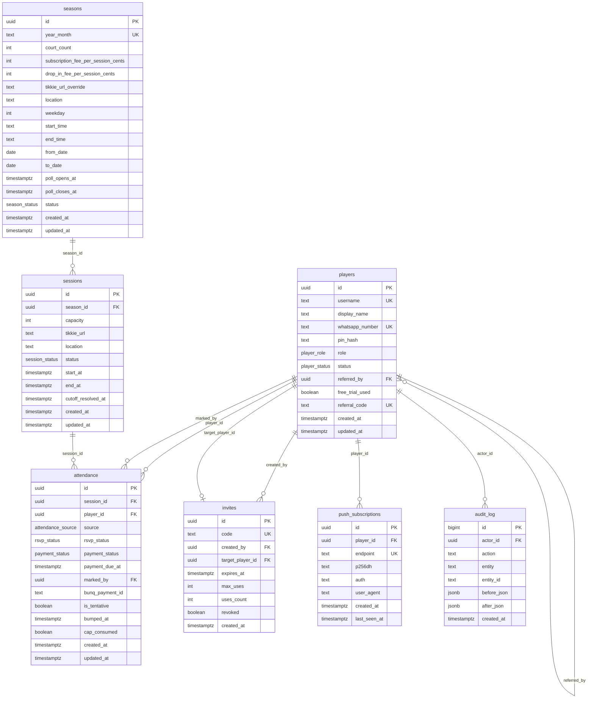

# Database Schema

Supabase Postgres. All timestamps stored as `timestamptz` (UTC). Money as integer cents.

## Entity Relationship Diagram

## Enums

| Enum | Values |
|---|---|
| `player_role` | `player`, `admin` |
| `player_status` | `pending`, `active`, `blocked` |
| `season_status` | `poll`, `closed` |
| `session_status` | `scheduled`, `done`, `cancelled` |
| `attendance_source` | `subscription`, `drop_in`, `passed`, `referral` |
| `rsvp_status` | `in`, `opted_out`, `cancelled`, `waitlisted`, `passed` |
| `payment_status` | `assumed_paid`, `flagged`, `unpaid` |

## Key Design Notes

- **Slot passing.** A subscriber or paid drop-in can permanently transfer their session slot to another player. The passer's row is set to `rsvp_status = 'passed'` — distinct from `opted_out` (reversible self-opt-out) and `cancelled` (generic drop or left-waitlist). A `passed` row cannot be reclaimed via "I can make it again". The receiver gets a new attendance row with `source = 'passed'` and `payment_status = 'assumed_paid'`.
- **`rsvp_status` semantics.** `in` = confirmed; `opted_out` = self opted out this session (reversible); `waitlisted` = waiting for a freed seat (reversible); `cancelled` = generic cancel (drop-in left, left waitlist — reversible); `passed` = permanently gave slot to another player (irreversible).
- **Subscriptions are attendance rows.** The separate `subscriptions` table was dropped (migration `0017`). A subscriber is simply an `attendance` row with `source = 'subscription'` and an `rsvp_status` of `in`.
- **Trust-first payments.** `payment_status` defaults to `assumed_paid`; admin only flags anomalies. Drop-ins get a `payment_due_at` deadline; unpaid rows are auto-cancelled by `resolve_session_cutoff`.
- **Referral system.** Active members have a permanent `referral_code`. A referred guest (`source = 'referral'`) gets one free session (`is_tentative = true`); at cutoff the guest is either locked in (`free_trial_used = true`) or bumped in favour of a waitlisted member.
- **Cutoff resolver.** `resolve_session_cutoff(uuid)` is an idempotent Postgres RPC called lazily before any attendance read/write. It promotes waitlisted players, bumps tentative referral guests, and sets `cutoff_resolved_at`.
- **RLS is deny-all.** All tables have RLS enabled but no permissive policies. Only the `service_role` key (used server-side) can read/write. The browser client cannot access any data directly.

## Stored Functions

| Function | Called by | Purpose |
|---|---|---|
| `resolve_session_cutoff(p_session_id uuid)` | Server actions, SSR routes | Atomic cutoff: promote waitlist, bump tentative guests, cancel unpaid drop-ins. `service_role` only. |
| `set_updated_at()` | `BEFORE UPDATE` triggers on all tables | Keeps `updated_at` current. |
